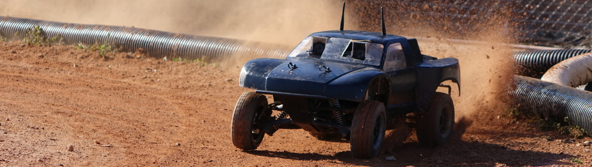

# AutoRally



Software for the AutoRally research platform.

[AutoRally Platform Website](http://autorally.github.io)

[AutoRally Youtube Channel](https://www.youtube.com/channel/UCSt0P1uqi4zU5RX2DZC_Qvg)

[Platform Paper](https://ieeexplore.ieee.org/abstract/document/8616931)

BibTex:
```
@article{goldfain2019autorally,
  title={AutoRally: An Open Platform for Aggressive Autonomous Driving},
  author={Goldfain, Brian and Drews, Paul and You, Changxi and Barulic, Matthew and Velev, Orlin and Tsiotras, Panagiotis and Rehg, James M},
  journal={IEEE Control Systems Magazine},
  volume={39},
  number={1},
  pages={26--55},
  year={2019},
  publisher={IEEE}
}
```
## Contributing

We welcome bug fixes, ehancements, new features, and [feedback](https://github.com/AutoRally/autorally/issues)!

Please submit pull requests to the [melodic-devel branch](https://github.com/AutoRally/autorally/pull/new/kinetic-devel) that conform to the [ROS C++ Style Guide](http://wiki.ros.org/CppStyleGuide). We use Gitflow, so master branch is reserved for releases.

## Setup Instructions

### Contents
1. [Install Prerequisites](#1-install-prerequisites)
2. [Clone repository](#2-clone-or-fork-repositories)
3. [Install AutoRally ROS Dependencies](#3-install-autorally-ros-dependencies)
4. [Compilation/Running](#4-compilation-running)
5. [Generate Documentation](#5-generate-documentation)
6. [Test Setup in Simulation](#6-test-setup-in-simulation)
7. [Autonomous Driving in Simulation](#7-autonomous-driving-in-simulation)

### 1. Install Prerequisites
1. __Install [Ubuntu 18.04 64-bit](http://www.ubuntu.com)__
2. __Install required packages__

   ```sudo apt install git doxygen openssh-server libusb-dev texinfo```

   ROS Melodic only supports Python 2.7. Before installing Python packages, you need to ensure that `python` points to Python 2.7, e.g., by setting up a Python 2.7 [conda environment](https://docs.conda.io/projects/conda/en/latest/user-guide/tasks/manage-environments.html#creating-an-environment-with-commands):

   ```
   conda create -n my_ros_env python=2.7
   source activate my_ros_env
   conda install defusedxml
   conda install -c jdh88 rospkg
   ```

   The following tools are recommended, but not required for this project.
   * cutecom
   * cmake-curses-gui
   * synaptic
   * python-termcolor

   ```sudo apt install cutecom cmake-curses-gui synaptic python-termcolor```

3. __[Install](http://www.ros.org/install/) ros-melodic-desktop-full__

4. __Install MPPI Dependencies (if you have a GPU and will run MPPI)__

    The core idea behind MPPI is to sample thousands of trajectories really fast. This is accomplished by implementing the sampling step on a GPU, for which you will need CUDA. We also use an external library to load python's numpy zip archives (.npz files) into C++.

    * [Install CUDA](https://developer.nvidia.com/cuda-downloads)
    * [Install CNPY](https://github.com/rogersce/cnpy)

5. __Install gtsam__


   Follow the gtsam [Quick Start](https://bitbucket.org/gtborg/gtsam/) guide to clone and install the _develop_ branch of gtsam.

   Instead of `cmake ..`, use:

   ```cmake -DGTSAM_INSTALL_GEOGRAPHICLIB=ON -DGTSAM_WITH_EIGEN_MKL=OFF ..```

   Once install is complete, make sure linux can see the shared library:

   ```sudo ldconfig```
   
6. __Update to latest version of gazebo 9.XX__
    
    You will want to be on the latest version of gazebo 9.
       

### 2. Clone or Fork Repositories

Get the autorally repository in a [catkin workspace](http://wiki.ros.org/catkin/workspaces). The suggested location is `~/catkin_ws/src/`, but any valid catkin worskspace source folder will work. We suggest forking over cloning if you will be working with the code.

Also clone the IMU code and Pointgrey camera drivers into the same catkin workspace:

    git clone https://github.com/AutoRally/imu_3dm_gx4.git
    git clone https://github.com/ros-drivers/pointgrey_camera_driver.git
    
### 3. Build Pointgrey Camera Driver

Since there are no pre-built drivers for Melodic, follow [these instructions](https://github.com/ros-drivers/pointgrey_camera_driver/issues/183#issuecomment-487143728) to build the driver yourself.

- The SDK can be downloaded [here](https://flir.app.boxcn.net/v/Flycapture2SDK/folder/72274730742). The file to download is `flycapture2-2.13.3.31-amd64-pkg_Ubuntu18.04.tgz`.
- You may need to run `sudo apt --fix-broken install` after installing the suggested packages and before running `sudo sh install_flycapture.sh`.

### 4. Install AutoRally ROS Dependencies

Within the catkin workspace folder, run this command to install the packages this project depends on.

```rosdep install --from-path src --ignore-src -y```

### 5. Compilation & Running

First, check your Eigen version with `pkg-config --modversion eigen3`. If you don't have at least version 3.3.5, [upgrade Eigen](https://github.com/eigenteam/eigen-git-mirror) by following "Method 2" within the included `INSTALL` file.

Then, to compile and install, run `catkin_make` from the catkin workspace folder. If your version of CUDA does not support `gcc-7`, you may need to use

`catkin_make -DCMAKE_C_COMPILER=gcc-6 -DCMAKE_CXX_COMPILER=g++-6`

Due to the additional requirement of ROS's distributed launch system, you must run

`source src/autorally/autorally_util/setupEnvLocal.sh`

before using any AutoRally components. See the [wiki](https://github.com/AutoRally/autorally/wiki) for more information about how to set this system up for distributed launches on your vehicle platform.

_Note:_ If you are unfamiliar with catkin, please know that you must run `source catkin_ws/devel/setup.sh` before ROS will be able to locate the autorally packages (and thus you must run this before sourcing `setupEnvLocal.sh`). This line can be added to your ~/.bashrc file so that it is automatically run on opening a terminal.

### 6. Generate Documentation

You can generate or update code documentation by running `doxygen` in `autorally/`.

To view code documentation open `autorally/doc/html/index.html` in a web browser.

### 7. Start the AutoRally Simulation to Test Configuration

```roslaunch autorally_gazebo autoRallyTrackGazeboSim.launch```

You can use a USB gamepad to drive the simulated platform around. On startup, the `runstop` message published by the `joystick` node is **false**. Press any of the buttons by the right stick (normally labelled X, Y, A, B or square, triangle, X, circle) to toggle the published value.

Verify runstop motion is enabled by looking at the `runstopMotionEnabled` field in the `/chassisState` topic (`rostopic echo /chassisState`).

If you aren't using a gamepad, you will have to configure another source of runstop information for the platform to move:

- Comment out the line `<include file="$(find autorally_control)/launch/joystickController.launch" />` near the end of `autorally_gazebo/launch/autoRallyTrackGazeboSim.launch`

- `rosrun rqt_publisher rqt_publisher`

and configure rqt_publisher to publish a message to topic `/runstop` of type `autorally_msgs/runstop` at 1 Hz with `sender` set to `rqt_publisher` and  `motionEnabled` set to **true**.

- Verify that `runstopMotionEnabled` is **true** in `/chassisState` topic.

### 8. Autonomous Driving in Simulation

At the end of this section the robot will be driving autonomously in simulation using controllers available in `autorally_control`.

Position the robot in the same spot as when the simulation starts and make sure runstop motion should is enabled (set to **true**).

#### Start waypoint follower:

    roslaunch autorally_control waypointFollower.launch

#### Start constant speed controller and tell it what speed to drive:

    roslaunch autorally_control constantSpeedController.launch
    rosrun rqt_publisher rqt_publisher

Configure a publisher on topic `constantSpeedController/speedCommand` of type `std_msgs/Float64` at rate 10 with value of 3 (you can adjust he value once everything is running). The value is the target velocity in m/s, and **as soon as you do this the platform should move if motion is enabled**.

If the robot turns and hits the barrier it's probably because the state estimator has not converged, so its orientation estimate is incorrect. Just select the track barriers and move them up to allow the robot to continue driving, and the estimator should converge and the vehicle will return to within the barriers.

## What's Next

More detailed explanations of the controllers and state estimator can be found on the [wiki](https://github.com/AutoRally/autorally/wiki):
* [State estimator](https://github.com/AutoRally/autorally/wiki/State%20Estimator)
* [Waypoint follower](https://github.com/AutoRally/autorally/wiki/Waypoint%20Following)
* [Constant speed controller](https://github.com/AutoRally/autorally/wiki/Constant%20Speed)
* [MPPI Controller](https://github.com/AutoRally/autorally/wiki/Model-Predictive-Path-Integral-Controller-(MPPI))

[Controlling the AutoRally platform](https://github.com/AutoRally/autorally/wiki/Controlling%20the%20AutoRally%20Platform) is a tutorial for how your own controller can control the AutoRally platform (in simulation or on hardware).

[Running Vehicles in Simulation](https://github.com/AutoRally/autorally/wiki/AutoRally-Gazebo-Simulation) is a tutorial on how run gazebo in the two different worlds and with multiple vehicles.

If you are configuring a physical AutoRally platform, the next step is to configure the compute box, all of the peripherals, and the launch system. Those instructions are found in the [Platform Configuration Instructions](https://github.com/AutoRally/autorally/wiki/Platform%20Configuration%20Instructions).
